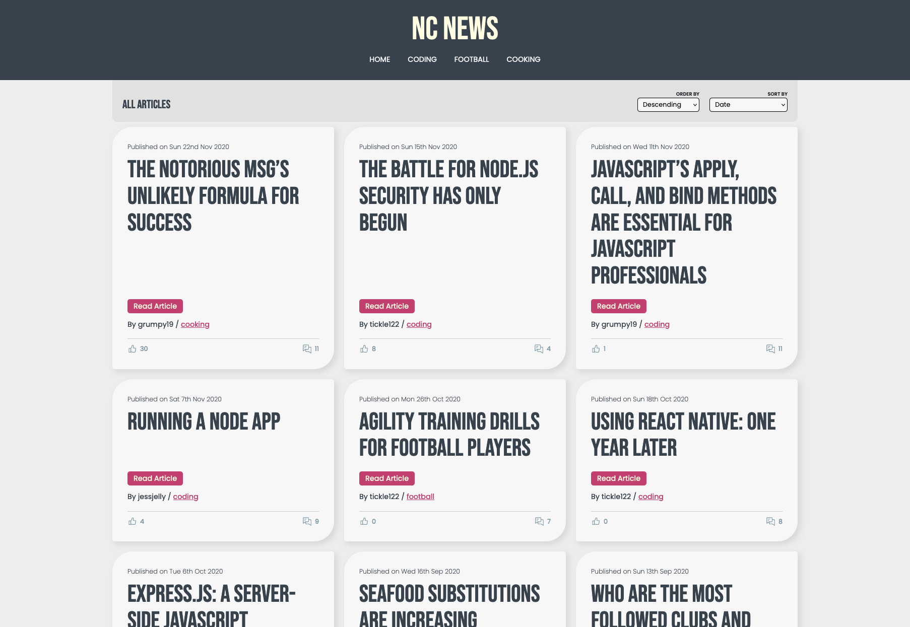
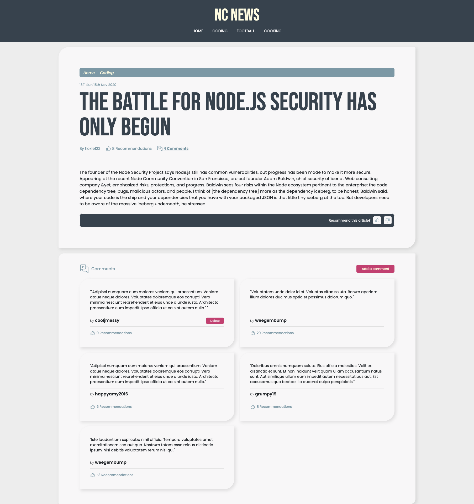
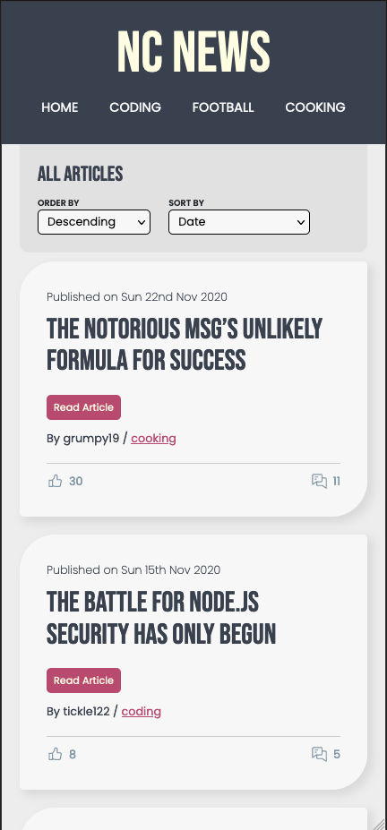

# Northcoders News

Northcoders News is a social news aggregation, web content rating, and discussion website.

The live site is available to view [here](https://dan-ncnews.netlify.app/).
The codebase can be found in my Github repo [here](https://github.com/dan77uk/nc-news).

Northcoders News has articles which are divided into topics. Each article has user curated ratings and can be up or down voted using the API. Registered users can also add comments about an article.

This is a [C.R.U.D](https://en.wikipedia.org/wiki/Create,_read,_update_and_delete) application, built in React, with the [API](https://github.com/dan77uk/be-nc-news) built in a Test Driven Development environment using Express, PostgreSQL and Supertest.





### Required Node Version

```
node v18.12.1
```

### Running This App Locally

If you would like to to run this project in your local enviroment, please enter the following commands in your terminal:

```
1. cd <your chosen folder>
2. git clone git@github.com:dan77uk/nc-news.git
3. cd nc-news
4. npm install
5. npm start
```
